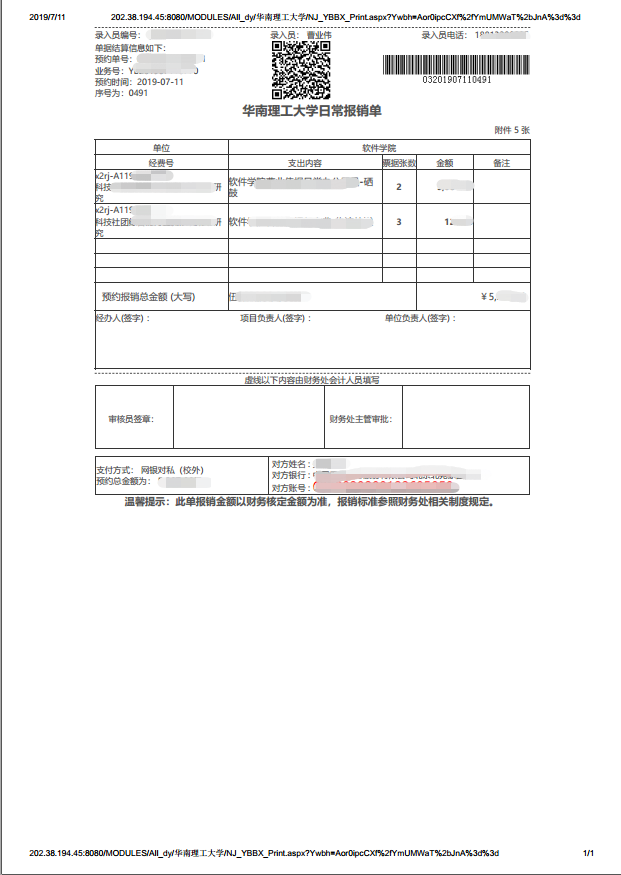

# 报销指南
## 1日常报销
需要材料：
1. 粘贴单16年或者17年版本均可 
2. 网报单 
3. 发票 
4. （情况说明，大于1000需要的转账记录）
### 1.1粘贴发票规则：
1. 用普通的胶水、浆糊粘贴发票即可，请勿用固体胶、双面胶粘贴发票
2. 贴发票请勿超过粘贴单最左边的粘贴线，尤其是火车票，超过粘贴线发票金额在装订时会被遮住，以后审计翻阅凭证会看不到发票金额
3. 和A4纸一样大的电子发票，以后不用粘贴在粘贴单上，直接夹在粘贴单上即可。电子发票不要缩小打印，直接打印成A4大小即可
4. 国外、境外非电子发票还是要贴在粘贴单上，整理凭证的老师、学生助理是非专业财务人员，不能辨认这种发票和其他附件的区别
5. 非发票的附件、出差审批单、网报单，请不要和粘贴单贴在一起，以后凭证室不方便装订凭证
6. 粘贴范围：粘贴发票时，粘贴部位不要超过下图中红色粗线范围

### 1.2报销分类，额度限制：
1. 笼统分类：
    1. 办公费——办公用消耗品、文具及纸张等
    2. 饮用水——工作人员饮用水（计入其他办公费）
    3. 资料费——书籍、报刊、检索查新、小软件、复印、打印
    4. 印刷费——批量、大额印刷费（金额≥1000元）
    5. 版面费——论文发表版面费
    6. 电话费——程控或移动电话，网络电话（IP/200卡）费用
    7. 网络费——有关网络的费用
    8. 邮寄费——信函、货物、包裹、现金邮寄及邮政费
    9. 专利费——专利申请和维持费用
    10. 国内差旅费——按学校差旅费管理办法可支出的国内差旅费（含差旅费补助、会议注册费）
    11. 市内交通费——广州市内的士费、临时停车费、过桥过路费
    12. 燃油费——汽油、柴油等，**网报单需要注明车牌**
    13. 维修费——设备日常修理保养保修、零配件更换、建筑物维修、公共设施维修、车辆维修费
    14. 材料费——科研用药品试剂及实验室用低值易耗品、体育用品、专用服装
    15. 设备费——需办固定资产的办公家具及设备，教学、科研、体育、医疗设备及其他需办**固定资产**的设备
    16. 测试费——科研用途的分析、测试、技术服务、实验费
    17. 加工费——委托外单位办理加工业务而支付的费用
    18. 科研协作费——委托外单位协作科研而转拨的费用
    19. 加班工作餐——因业务加班而发生的必要的、少量的餐费
    20. 其他——租赁费、会议费、军训费、宣传费、团体会费、接待餐费等，请在空白栏自行填写
2. 特殊注意事项：
    1. 只有要作为固定资产的，才可以报销成设备费
    2. 维修费范围：建筑物维修费、设备维修费
        1. 设备维修费：设备类的维修零配件：如：电脑里的内存条、硬盘、显卡；鼠标键盘等；
        2. 冰箱、空调、服务器等设备的维修费。若发票摘要未注明“维修费”，则单价超过1000元要设备处办理免报固定资产，方可出维修费。
        3. 建筑物维修费：刷墙、走线等，单笔超过10000元，要通过后勤办手续
    3. 螺丝、起子作为材料费报销
    4. **办公费适用范围最多**，优先考虑成办公费
    5. 每一张发票后面需要有一个证明人，一个经办人签字
    6. 加班工作餐发票：
        1. 签字需要一个证明人，一个经办人，并且注明加班工作餐
        2. 列出工作餐人员
        3. 人均不得超过**50**元
        4. 总额大于**200**元以上，需要给出转账记录（支付宝微信银行卡均可，需要与发票开票单位一致）
        5. 网报单上需要去掉工作餐字样
        6. 学院经费（发展基金）不可以用于报销工作餐
    7. 只有市内交通发票，开一张市内交通单，可以不用写证明人经办人，否则也要写
    8. 固定资产 ：
        9. 固定资产报增单上的金额，只能是固定资产的金额，不能有低值易耗品、材料费、办公用品等金额；
        2. 如果固定资产报增单上有不属于固定资产的金额，财务人员无权修改凭证金额，只能退回给老师们自行修改；
        3. 建议老师们购买设备时，不要把不属于固定资产的物品和固定资产开在同一张发票上；
        4. 报销固定资产业务，不需要做网报单，财务人员做凭证以固定资产报增单为依据，固定资产报增单上的销售公司名称、开户行、开户账号要准确。
3. 报销额度要求：
    1. 一次报销办公用品，如果金额达到**5千元**，需要2名主管审批；达到**1万元**，需要3名主管审批（尽量不要一次性超过5千）
    2. 燃油费一次报销不要超过2千元，全年报销金额根据您自己的实际情况，要经得起审计检查（曾经华工有的老师全年报销的燃油费被审计质疑洗澡都用不完）
    3. 一次报销市内交通费如果金额达到**1千元**，请在市内交通单上详细备注您的事由；同一份网报单的士费发票，不得出现**同一车牌号**的士发票
    4. 一次报销邮寄费达到**1千元**，请在粘贴单上备注具体用途
    5. 加班工作餐报销，除了人均不得超过**50元/人**外，还要注意合理性，如：**餐费发票不能是酒吧、夜总会、休闲会馆、五星级酒店等场所的发票**
    6. 一次性报销达到**2千元**电话费，如果电话费发票上未注明电话费消费日期，请在粘贴单上备注电话费使用日期、使用人姓名
    7. **发票连号**，同一天开具，仍会被视为同一张发票，会容易受到额度限制，连号发票最好分成不同的项目报销
### 1.3报销项目种类（学院项目，个人横向，个人纵向）：

科研项目通常分纵向和横向。经费来源性质属于财政资金，为纵向项目；经费来源性质属于社会资金，则为横向项目。

1. 学院经费：
目前有三种经费，分别是子项目，学科建设（边上有红字标注），著作奖励
这三种都笼统的叫做发展基金，是学院经费，报销还需要**开具红单**，报销较为严格，如果用学院经费报销劳务费，需要一式两份
具体要用哪个经费要看具体情况
### 1.4粘贴单填写规范：

第一步
个人项目
- 主管：老师（个人项目经费主管）
- 报账人：做这份报销的人（经办人）

学院项目
- 主管：院长（学院项目经费主管，找老师盖院长章）
- 报账人：做这份报销的人（经办人）

第二步
部门编码：x2rj
项目编码：示例学院经费发展基金P0001002
填写好票据张数和费用合计

第三步
分类填写好票据张数和费用
### 1.5网报单填写规范：

经办人和项目负责人要有签字（若为同一个人则都签字）
## 2差旅报销
需要材料：
1. 粘贴单16年或者17年版本均可 
2. 差旅网报单 
3. 发票 
4. 差旅审批单 
5. 出差报销单（多人必须要有，单人可以没有）
6. (情况说明，大于1000机票需要的转账记录）

出差交通工具，住宿价格
1. 一般以硬卧，动卧，高铁二等座，飞机经济舱为主，软卧不可以报销。
2. 住宿价格有要求标准，一般快捷酒店不会超过，注意开的发票要注明天数，多天开成一天的住宿费比较麻烦
