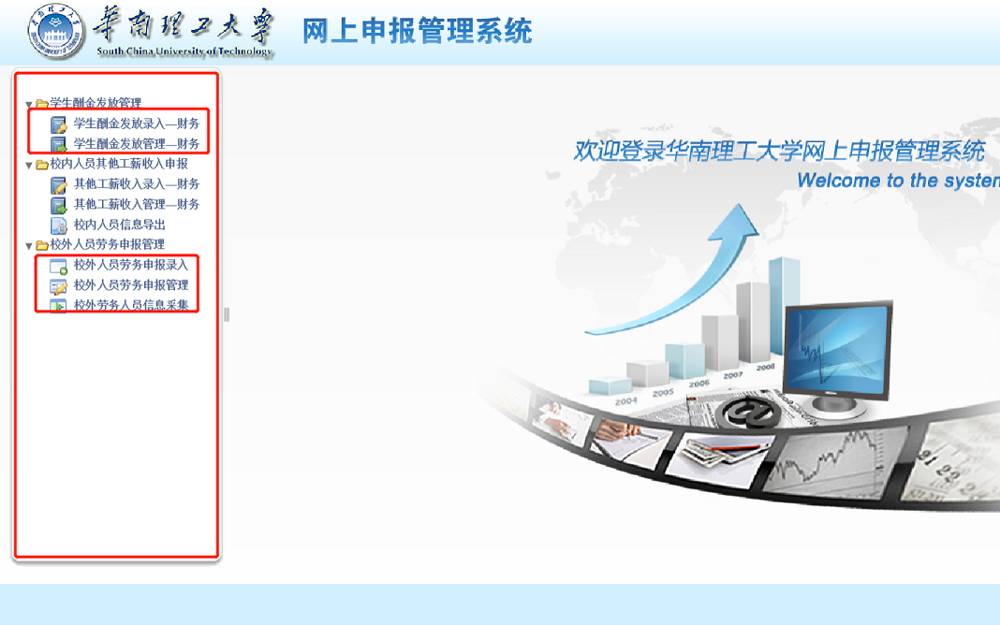
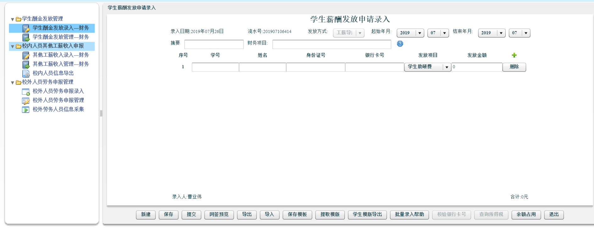
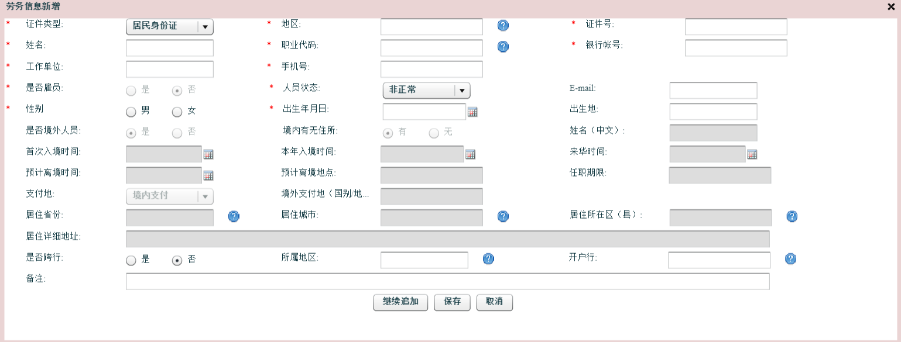
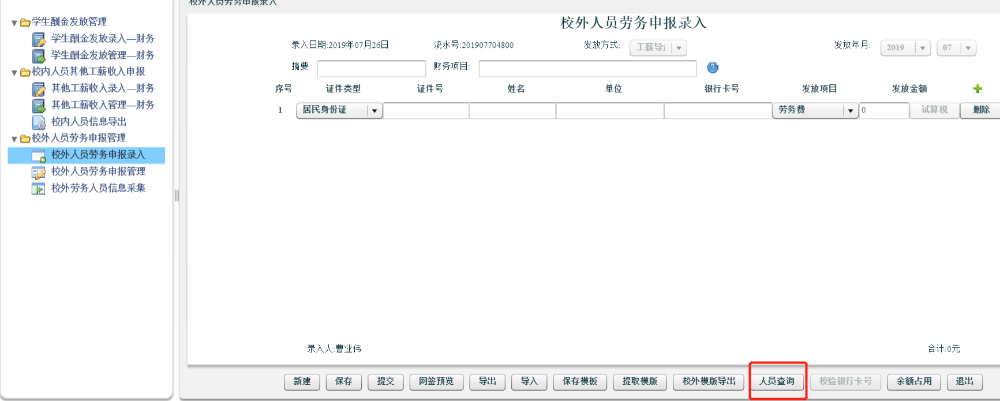
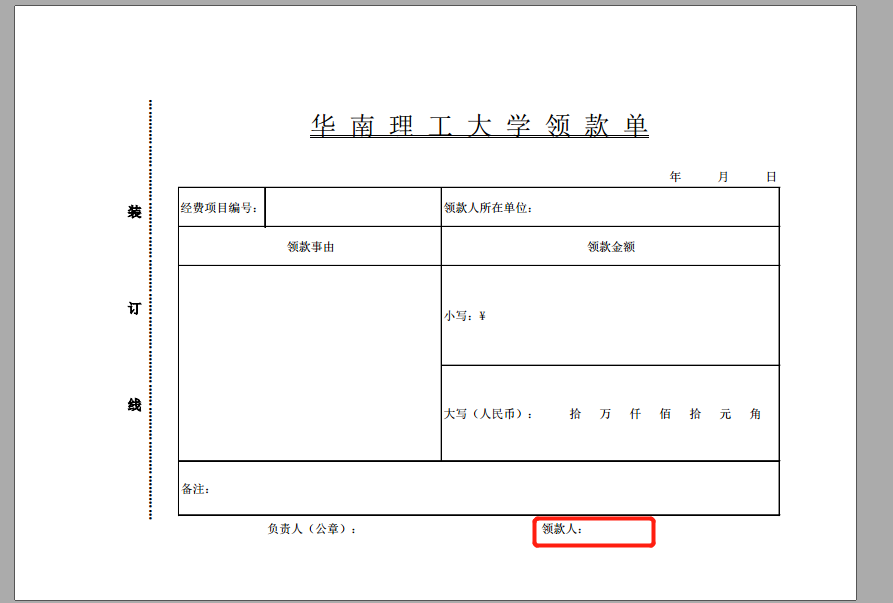
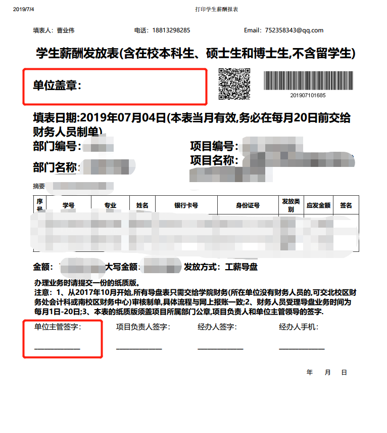

# 酬金发放

## 校内酬金发放
1. 第一步学生酬金发放录入

2. 填写好摘要（一般是学生三助）项目名称 学生学号 发放金额即可
3. 本科生一般是劳务费，研究生一般选择学生助研费
## 校外酬金发放
1. 首先进行校外人员录入

然后点击新增

填写必填项即可，若没有给出手机号则直接填写你的手机号，没有给出银行账号则填写16个0

2. 录入完信息，点击申报录入

查询到刚才录入的人员即可，其他填写同第一种情况，摘要一般是劳务费之类
## 导盘与非导盘
- 导盘就是会打到相应的录入人员的账户之中
- 非导盘就是在老师提前垫付钱的情况下，银行卡号未知，先把钱打给老师，再由老师处理的情况
非导盘需要开领条，表示从经费中领了多少钱

领款人是老师签字
## 酬金扣税额度
- 本校有学号的学生，每月劳务费**800**元以下不扣税，超过**800**元暂时按劳务费扣税。
年底按每人每年**60000**元以下不扣税汇算清缴，退税会打到学生的银行卡中。
## 其他事项
- 如果用学院经费发劳务费，酬金表要是一式两份
- 导盘的劳务费表格要签字，**字迹一定要不一样**
- 酬金表需要盖院长章，并且盖学院章
 
